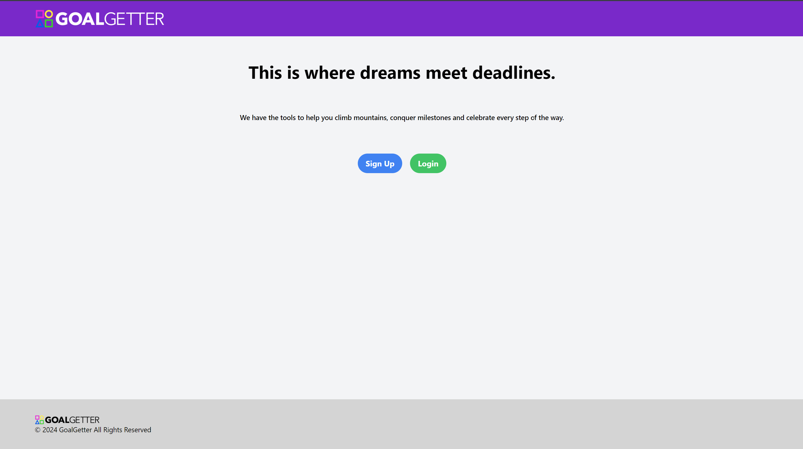
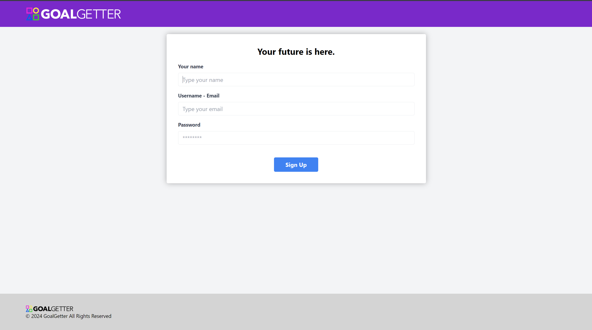
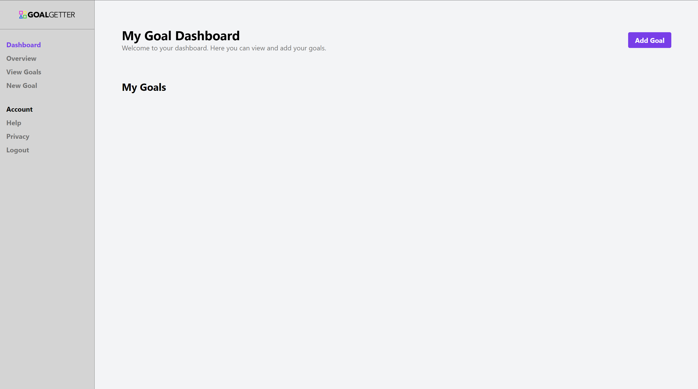
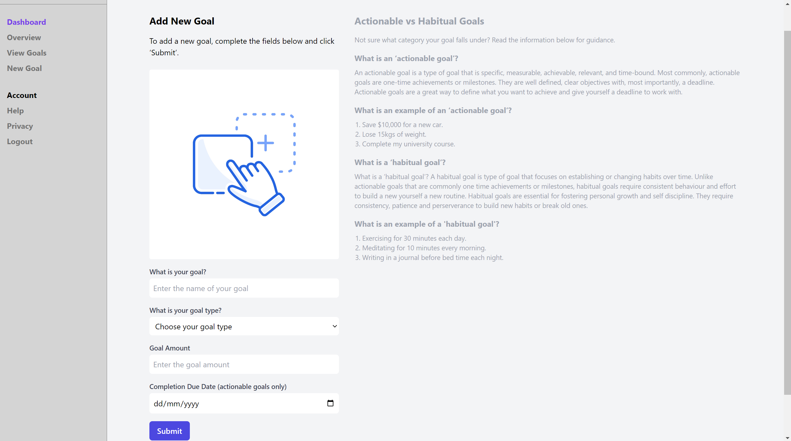
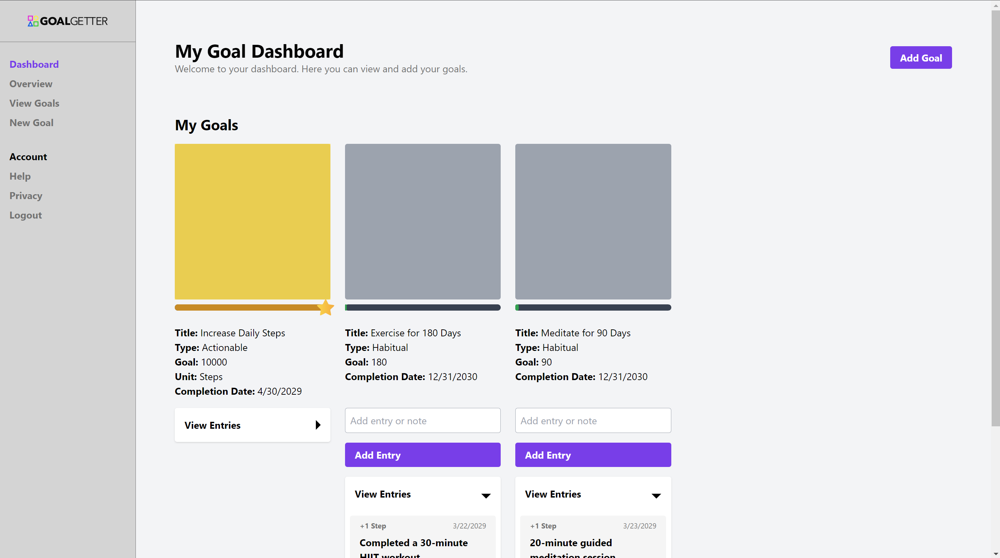
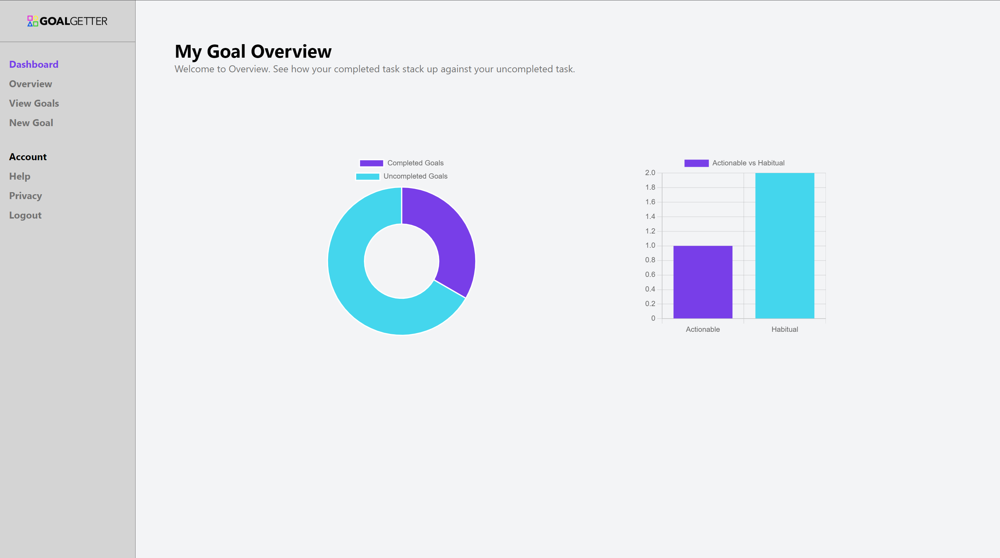

# GoalGetter

## Description

Introducing GoalGetter, your personal success sidekick! Climb mountains and conquer milestones with this goal setting application built by University of Adelaide Coding Bootcamp students Ben Taylor, Dinh Nguyen, Badrul Borhanudin and Matt Kelly.

## Table of Contents

- [Description](#description)
- [Installation](#installation)
- [Usage](#usage)
- [Contribution](#contribution)
- [Tests](#tests)
- [License](#license)
- [Questions](#questions)

## Installation Instructions

To install this application, clone this repository to your local machine and install all relevant packages by executing **'npm install'**. Please note, Node.js must be installed on your local machine for this application to run.

## Usage

To view a live demonstration of this application, please visit this [link](https://github.com/mattkellyirl/).

## Screenshots of Application Walkthrough
The following image shows the web application's appearance and functionality:
1. Users will be presented with a homepage that has Sign Up and Login options.

2. The following screenshot is the Sign Up page.

3. Once signed up, users will be taken to their Dashboard.

4. Here, users can add their goal. If unsure what type of goal, they can read the guidelines next to it.

5. This is a sample preloaded data from a user Sal (taken from our seeds). Note that completed goal will have a Star icon as shown.

6. Graphical view of users' goals representing completion of goals and the types of goals are on the Overview page.

## Contribution Guidelines

This project was developed by Ben Taylor, Dinh Nguyen, Badrul Borhanudin and Matt Kelly.

## Tests

There are no tests associated with this project.

## License

This project is not licensed. For more information regarding licenses, please visit this link: https://opensource.org/license/

## Questions

Please feel free to contact the development team via our GitHub or email links below for any questions associated with this application:

Ben Taylor:  
GitHub: [github](https://github.com/zaczacariah)  
Email: ben-zac@outlook.com

Dinh Nguyen:  
GitHub: [github](https://github.com/DinhN17)  
Email: nquydinh@gmail.com

Badrul Borhanudin:  
GitHub: [github](https://github.com/BadrulBorhanudin)  
Email: badrulborhanudin@gmail.com

Matt Kelly:  
GitHub: [mattkellyirl](https://github.com/mattkellyirl)  
Email: mattkellyvisual@gmail.com
